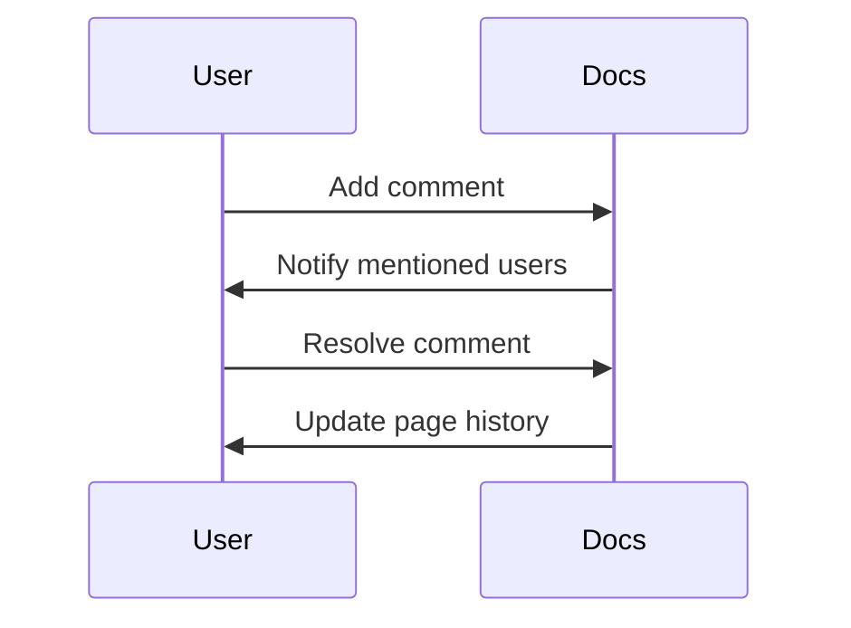

## Overview

Inuba Documentation enables seamless team collaboration. You manage permissions, invite contributors, and gather feedback through comments. These features ensure secure and efficient workflows for your projects.

<Columns cols={3}>
  <Card title="User Roles" icon="users" href="#user-roles">
    Define access levels for team members.
  </Card>
  <Card title="Invite Collaborators" icon="mail" href="#invite-collaborators">
    Add team members quickly.
  </Card>
  <Card title="Comments & Feedback" icon="message-circle" href="#comments-feedback">
    Review and discuss changes.
  </Card>
</Columns>

## User Roles and Permissions

Assign roles to control what users can do. Each role grants specific permissions.

| Role       | View Pages | Edit Content | Manage Users | Delete Pages |
|------------|------------|--------------|--------------|--------------|
| Viewer     | ✅         | ❌           | ❌           | ❌           |
| Editor     | ✅         | ✅           | ❌           | ❌           |
| Admin      | ✅         | ✅           | ✅           | ✅           |

<Callout kind="tip">
  Start with Viewer roles for external reviewers to minimize risks.
</Callout>

<Expandable title="Advanced Permissions" default-open="false">

You fine-tune permissions at the space or page level. For example, restrict edits to specific folders.

</Expandable>

## Invite Collaborators

Follow these steps to add team members.

<Steps>
  <Step title="Navigate to Settings" icon="settings">
    Open your space settings from the sidebar.
  </Step>
  <Step title="Enter Email" icon="mail">
    Type the collaborator's email address.
  </Step>
  <Step title="Select Role" icon="users">
    Choose Viewer, Editor, or Admin.
  </Step>
  <Step title="Send Invite" icon="send">
    Click Send. They receive an email with a join link.
  </Step>
</Steps>

<Tabs>
  <Tab title="Bulk Invite" icon="upload">
    Upload a CSV file with emails and roles.

    ```
    email,role
    user1@example.com,Editor
    user2@example.com,Viewer
    ```

    <Callout kind="info">
      Maximum 100 invites per bulk operation.
    </Callout>
  </Tab>
  <Tab title="API Invite" icon="code">
    Use the invite endpoint for automation.

    <CodeGroup tabs="JavaScript,cURL">
      ```javascript
      const response = await fetch('/api/v1/spaces/{spaceId}/invites', {
        method: 'POST',
        headers: { 'Authorization': `Bearer ${token}` },
        body: JSON.stringify({
          email: 'user@example.com',
          role: 'Editor'
        })
      });
      ```
      ```bash
      curl -X POST '/api/v1/spaces/{spaceId}/invites' \
        -H 'Authorization: Bearer {token}' \
        -H 'Content-Type: application/json' \
        -d '{"email":"user@example.com","role":"Editor"}'
      ```
    </CodeGroup>
  </Tab>
</Tabs>

## Comments and Feedback Workflows

Enable discussions directly on pages. Users add comments to specific sections.



<Callout kind="success">
  @mention users in comments with `{@username}` to notify them instantly.
</Callout>

Customize workflows with these options:

- **Inline Comments**: Highlight text and comment.
- **Page-Level Feedback**: General discussions.
- **Review Mode**: Lock page for comments only.

<ExpandableGroup>
  <Expandable title="Resolve Workflow">
    Mark comments as resolved once addressed. This tracks changes in the version history.
  </Expandable>
  <Expandable title="Export Feedback">
    Download all comments as PDF or CSV for records.
  </Expandable>
</ExpandableGroup>

These tools keep your documentation collaborative and up-to-date.