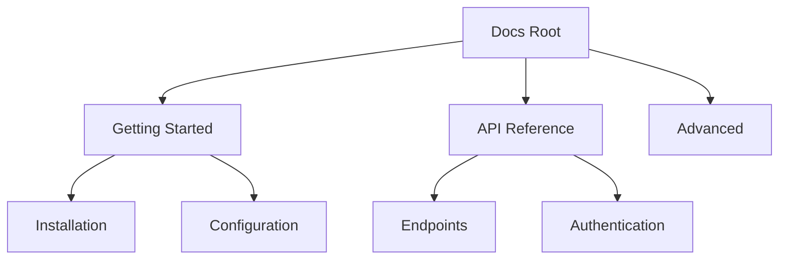

## Overview

In Inuba Documentation, you manage your project's docs by creating pages, structuring folders, and tracking changes. This guide walks you through essential workflows to keep your documentation organized and up-to-date. Start with simple creation and scale to advanced versioning.

<Callout kind="tip">
  Use descriptive titles and YAML frontmatter for better navigation and SEO.
</Callout>

## Creating and Editing Documents

Follow these steps to create a new document or edit an existing one.

<Steps>
  <Step title="Create New Document" icon="file-plus">
    Click the `New Page` button in the sidebar. Choose `MDX` format for rich components.

    ```bash
    # Example frontmatter for new page
    ---
    title: My New Guide
    description: Overview of the guide.
    ---
    ```
  </Step>
  <Step title="Edit Content" icon="edit-3">
    Open the page in the editor. Use Markdown for text and MDX components like `<Callout>` for highlights.

    Add realistic content:

    ````mdx
    ## Quick Start

    Install via npm:

    ```bash
    npm install inuba-docs
    ```
    ````
  </Step>
  <Step title="Preview and Publish" icon="eye">
    Preview changes in real-time. Click `Publish` to make live, or `Save Draft` for later.
  </Step>
</Steps>

## Organizing Folder Structures

Structure your docs hierarchically for easy navigation. Use folders to group related pages.



<Columns cols={2}>
  <Card title="Best Practices" icon="folder" href="#">
    Limit nesting to 3 levels. Name folders by topic.
  </Card>
  <Card title="Naming Conventions" icon="tag" href="#">
    Use kebab-case: `user-guide.mdx`, `api-v2/`.
  </Card>
</Columns>

| Structure Type | Use Case | Example Path |
| -------------- | -------- | ------------ |
| Flat | Small projects | `/quickstart.mdx` |
| Nested | Large docs | `/guides/advanced/deployment.mdx` |
| Versioned | APIs | `/api/v1/endpoints.mdx` |

## Managing Version History

Track changes with built-in versioning. You access history via the page menu.

<Tabs>
  <Tab title="View History" icon="clock">
    Click `History` to see revisions. Compare diffs side-by-side.
  </Tab>
  <Tab title="Revert Changes" icon="undo">
    Select a version and click `Revert`. Creates a new revision automatically.
  </Tab>
  <Tab title="Branching" icon="git-branch">
    For major updates, create a branch: `git checkout -b feature/new-guide`.
  </Tab>
</Tabs>

<CodeGroup tabs="CLI,UI">
  ```bash
  # CLI: Check history
  git log --oneline docs/managing-documents.mdx
  ```
  ```mdx
  <!-- UI: Use the built-in diff viewer -->
  <Expandable title="Advanced Revisions">
    Cherry-pick specific commits for precise rollbacks.
  </Expandable>
  ```
</CodeGroup>

<Callout kind="alert">
  Always commit descriptive messages like `feat: add folder organization section`.
</Callout>

## Advanced Organization Tips

<ExpandableGroup>
  <Expandable title="Tagging Pages" default-open="true">
    Add tags in frontmatter: `tags: ["guide", "beginner"]`. Filter in search.
  </Expandable>
  <Expandable title="Search Optimization">
    Use H2-H4 headings and keywords naturally. Avoid overusing components.
  </Expandable>
</ExpandableGroup>

These practices ensure scalable, searchable docs. Next, explore [API integration](/docs/api) for dynamic content.